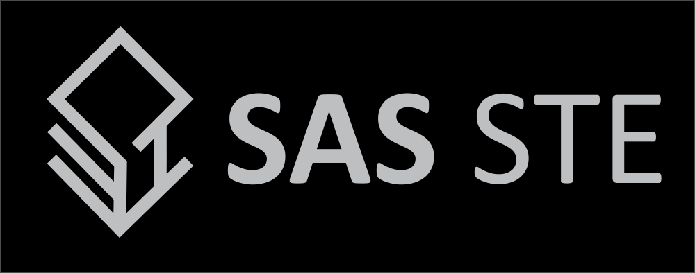

 

<b>SAS-STE</b>  ( Saaiq Abdulla Saeed's - Secure Text Encryption ) is an opensource text-based deterministic random substitution encryption algorithm developed by Saaiq Abdulla Saeed (saaiqSAS)

Web Page : https://saaiqsas.github.io/tools/sas-ste.html

 

## Status: Discontinued

This project is no longer actively maintained. It has been discontinued and will not receive any further updates or bug fixes.
**SAS-ROSET**, a much more advanced project, is now replacing this repository. It offers more robust solutions and high-security encryption based on the fundamentals of **SAS-STE Encryption**. 
check out **[SAS-ROSET](https://sas-roset.github.io)** for a more powerful and secure solution, with continued development and active support.

 

## Requirements
### SAS-STE-Wizard (For versions below v4.4.7)
> <a href="https://www.oracle.com/java/technologies/javase/jdk17-archive-downloads.html"> Java JDK <b>17+</b> </a>

 

## Latest Releases

### SAS-STE-Wizard
> <a href="https://github.com/saaiqSAS/SAS-STE/releases/tag/SAS-STE-Wizard-Windows_v4"> SAS-STE-Wizard-Windows <b>v4.4.7</b>  </a>

> <a href="https://github.com/saaiqSAS/SAS-STE/releases/tag/SAS-STE-Wizard-Linux_v4"> SAS-STE-Wizard-Linux <b>v4.4.7</b>  </a>

> <a href="https://github.com/saaiqSAS/SAS-STE/releases/tag/SAS-STE-Wizard-SourceCode_v4"> SAS-STE-Wizard-SourceCode <b>v4.4.7</b>  </a>

### SAS-STE-Mobile
> <a href="https://github.com/saaiqSAS/SAS-STE/releases/tag/SAS-STE-Mobile-Android_v4.4.6"> SAS-STE-Mobile-Android <b>v4.4.6</b>  </a>

> <a href="https://github.com/saaiqSAS/SAS-STE/releases/tag/SAS-STE-Mobile-Android-SourceCode_v4.4.6"> SAS-STE-Mobile-Android-SourceCode <b>v4.4.6</b>  </a>

 

## Documentation
> <a href="[https://www.oracle.com/java/technologies/javase/jdk17-archive-downloads.html](https://github.com/saaiqSAS/SAS-STE/blob/SAS/Documentation/SAS-STE%20Documentation.pdf)"> SAS-STE Documentation PDF </a>

 

## Related Tools
> <a href="https://saaiqsas.github.io/online-tools/sas-ste-web/sas-ste-web.html"> SAS-STE-Web - Online Tool </a>

> <a href="https://github.com/saaiqSAS/SAS-STE/releases/tag/SAS-STE-StaticKeyGen_NEW"> SAS-STE-StaticKeyGen </a>

> <a href="https://github.com/saaiqSAS/SAS-STE/releases/tag/SAS-STE-StaticKeyGen-SourceCode_NEW"> SAS-STE-StaticKeyGen-SourceCode </a>

